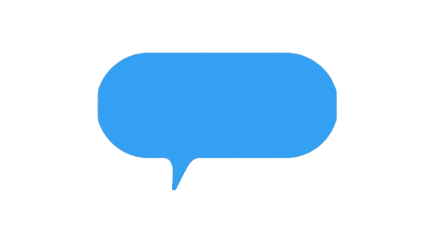
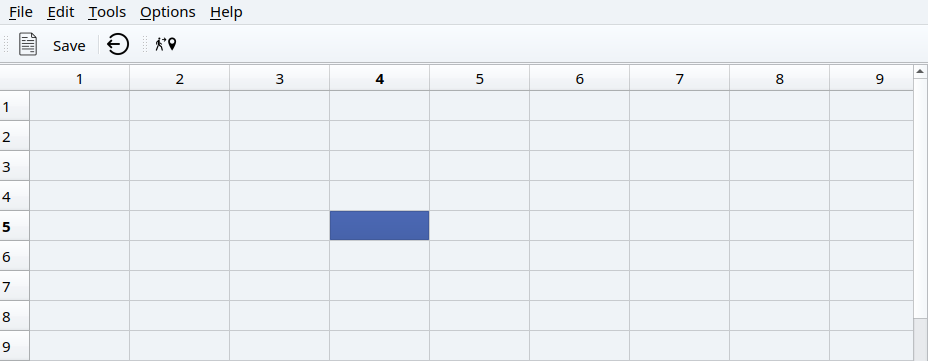
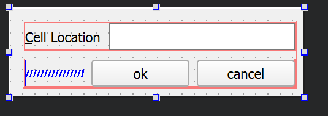
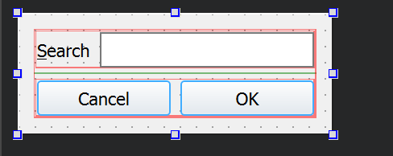
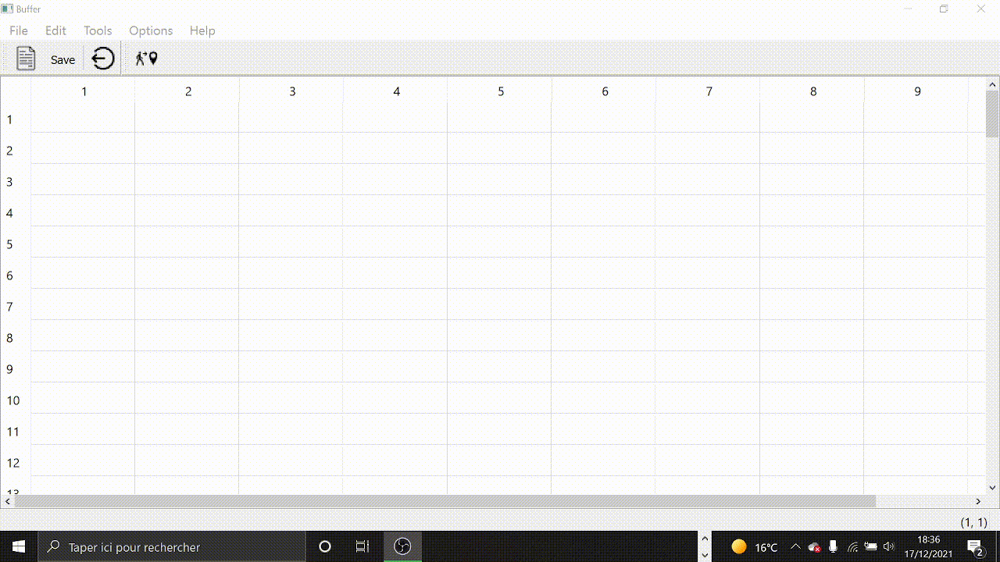
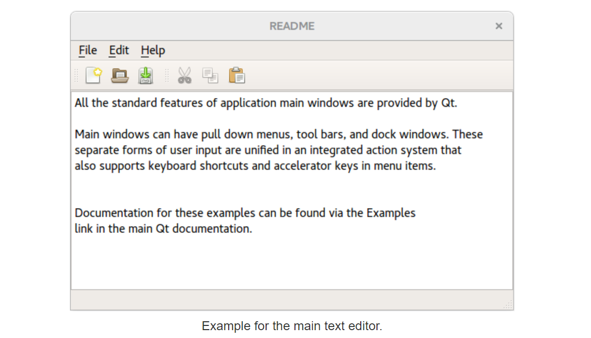
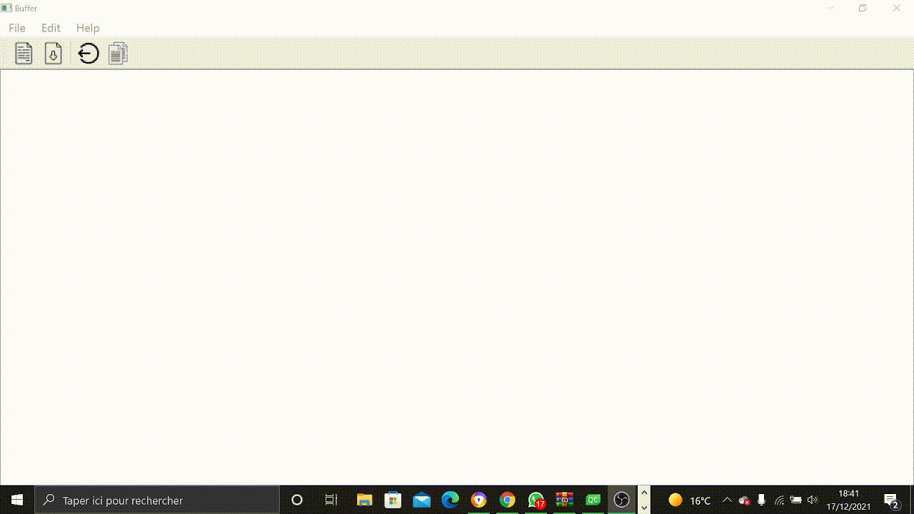

Graphical users’ interface (GUI) helps the computer users to interact with the computer by relocating the pointer on the screen and also pressing a button or other functionalities. Nowadays graphical interfaces have become both more powerful and more complex especially when you combined with the QT platform and qt designer tool for designing and building graphical user interfaces (GUIs) with Qt Widgets .To make it easier for people with few computer skills to work with and use computer software, the GUI create some elements that offer a consistent visual language to represent information in an easy way. Some of the elements are the main window that represent the main component of an application and other elements like menus …. 

**What we can create whit these elements? and how?**
# **Main window**

The main window is the entire working area of the program, that provides a framework for building an application's user interface.the main way to access other windows, load and save files... .This window include a different components as menu bar , tool bar and others that we can see in the following


Qt has **QMainWindow** and its related classes for main window management. QMainWindow has its own layout to which you can add QToolBars, QDockWidgets, a QMenuBar, and a QStatusBar. The layout has a center area that can be occupied by any kind of widget , we can defined some of them:
* **QMenuBar** : a class that contain a list of pull-down menu items horizontally 
* **QToolBar**: provides a movable panel that contains a set of controls
* **QStatusBar**: class provides a horizontal bar suitable for presenting status information


> **Our goal is to create application using the main window and the designer** 

# **SpreadSheet**

In this iteration we will create a spreadsheet that contains the following components:
* Menu Bar
* Tools Bar
* Status Bar

with their fonctionalities 

This application will combine between the graphical interface and the code that represent the set of basic fonctionality

> Our test is to have an application that looks like that with all the fonctionalities :




In this test we need to add two more classes and the main class that will associet all the others called Spreadsheet 

The two classes that we need represent two functionnalities :

* **Cell location (go to cell)**
* **Find**

# Go to cell

Now we will add the function for the goCell action. For that, we need to create a Dialog for the user to select a cell

Using the designer we create the following form :



Now we will create the class **GoDialog.h** and **GoDialog.cpp** that contain the regular expression validator for the lineEdit and a public Getter for the line edit Text to get the cell address

## **GoDialog.h**
```c++
#ifndef GODIALOG_H
#define GODIALOG_H

#include <QDialog>

namespace Ui {
class GoDialog;
}

class GoDialog : public QDialog
{
    Q_OBJECT

public:
    explicit GoDialog(QWidget *parent = nullptr);
    ~GoDialog();
 QString getText()const;//the public getter to get the adress cell
private:
    Ui::GoDialog *ui;
};

#endif // GODIALOG_H
```

and add the implementation of the methods in 

## **GoDialog.cpp**

```c++
#include "godialog.h"
#include "ui_godialog.h"
#include<QRegExp>
#include<QRegExpValidator>
GoDialog::GoDialog(QWidget *parent) :
    QDialog(parent),
    ui(new Ui::GoDialog)
{

    ui->setupUi(this);
     // the text must be acceptable
    //Validating the regular expression
     QRegExp regCell{"[A-Z][1-9][0-9]{0,2}"};

     //Validating the regular expression
     ui->lineEdit->setValidator(new QRegExpValidator(regCell));

}
QString GoDialog::getText()const
{
    return ui->lineEdit->text();
}

GoDialog::~GoDialog()
{


    delete ui;
}

```

>For the the connexion and the implementation of the slot we will add it in the Spreadsheet class

# Find

The second part concerning the find fonctionality we will create the **finddialog.h** and **finddialog.cpp**

Creating the format with the designer :



we will Add a Getter to obtain the searched text and the connexion between the find and the dialog 

## **GoDialog.h**

```c++
#ifndef FINDDIALOG_H
#define FINDDIALOG_H

#include <QDialog>

namespace Ui {
class finddialog;
}

class finddialog : public QDialog
{
    Q_OBJECT

public:
    explicit finddialog(QWidget *parent = nullptr);
    ~finddialog();
     QString getText()const;//the getter that we will use 

private:
    Ui::finddialog *ui;
};

#endif // FINDDIALOG_H

```

the implementation ofo the getter method in :

## **GoDialog.cpp**

```c++
#include "finddialog.h"
#include "ui_finddialog.h"
#include<QRegExp>
#include<QRegExpValidator>
finddialog::finddialog(QWidget *parent) :
    QDialog(parent),
    ui(new Ui::finddialog)
{
    ui->setupUi(this);

}
//the implementation of the getter 
QString finddialog::getText()const
{
    return ui->lineedit2->text();
}


finddialog::~finddialog()
{
    delete ui;
}

```

>the connexion will be in the spreadsheet class 

Now we will move to the main class that will associed all the connexions and the slots :

# **Spreadsheet.h**

The creating of the elements and methods :

```c++
#ifndef SPREADSHEET_H
#define SPREADSHEET_H

#include <QMainWindow>
#include <QTableWidget>
#include <QAction>
#include <QMenu>
#include <QToolBar>
#include <QLabel>
#include <QStatusBar>

class SpreadSheet : public QMainWindow
{
    Q_OBJECT

public:
    SpreadSheet(QWidget *parent = nullptr);
    ~SpreadSheet();

protected:
    void setupMainWidget();
    void createActions();
    void createMenus();
    void createToolBars();
    void makeConnexions();
    void aboutttQt();
    void aboutt();

private slots:
    void close();
    void updateStatusBar(int, int); //Respond for the call changed
    void goCellSlot();
    void saveslot();//slot that respond on the save 
    void findCell();
    void openfile();

private:
void Save(QString filename);//save the content 
void loadcontent(QString filename);

 //Pointers
private:
    // --------------- Central Widget -------------
    QTableWidget *spreadsheet;

    // --------------- Actions       --------------
    QAction * newFile;
    QAction * open;
    QAction * save;
    QAction * saveAs;
    QAction * exit;
    QAction *cut;
    QAction *copy;
    QAction *paste;
    QAction *deleteAction;
    QAction *find;
    QAction *row;
    QAction *Column;
    QAction *all;
    QAction *goCell;
    QAction *recalculate;
    QAction *sort;
    QAction *showGrid;
    QAction *auto_recalculate;
    QAction *about;
    QAction *aboutQt;


    // ---------- Menus ----------
    QMenu *FileMenu;
    QMenu *editMenu;
    QMenu *toolsMenu;
    QMenu *optionsMenu;
    QMenu *helpMenu;


    //  ------ Widget pour la bare d'etat
    QLabel *cellLocation;  //posiion of the active cell
    QLabel *cellFormula;   // Formuel of the active cell 
    //name of the file 
    QString * currentfile=nullptr;
};

#endif // SPREADSHEET_H

```
---
the implementation wil be in :

# **Spreadsheet.cpp**

```c++
#include "spreadsheet.h"
#include <QPixmap>
#include <QMenuBar>
#include <QToolBar>
#include <QApplication>
#include <QMessageBox>
#include<godialog.h>
#include<finddialog.h>
#include <QFileDialog>
#include <QTextStream>

SpreadSheet::SpreadSheet(QWidget *parent)
    : QMainWindow(parent)
{
    //Seting the spreadsheet

    setupMainWidget();

    // Creaeting Actions
    createActions();

    // Creating Menus
    createMenus();


    //Creating the tool bar
    createToolBars();

    //making the connexions
    makeConnexions();


    //Creating the labels for the status bar (should be in its proper function)
    cellLocation = new QLabel("(1, 1)");
    cellFormula = new QLabel("");
    statusBar()->addPermanentWidget(cellLocation);
    statusBar()->addPermanentWidget(cellFormula);
    //initite the name of the file 
    currentfile = nullptr;
    //add the name of the file 
    setWindowTitle("Buffer");
}
//set the main widget in the center 
void SpreadSheet::setupMainWidget()
{
    spreadsheet = new QTableWidget;
    spreadsheet->setRowCount(100);
    spreadsheet->setColumnCount(10);
    setCentralWidget(spreadsheet);

}
//the desctructor 
SpreadSheet::~SpreadSheet()
{
    delete spreadsheet;

    // --------------- Actions       --------------
    delete  newFile;
    delete  open;
    delete  save;
    delete  saveAs;
    delete  exit;
    delete cut;
    delete copy;
    delete paste;
    delete deleteAction;
    delete find;
    delete row;
    delete Column;
    delete all;
    delete goCell;
    delete recalculate;
    delete sort;
    delete showGrid;
    delete auto_recalculate;
    delete about;
    delete aboutQt;

    // ---------- Menus ----------
    delete FileMenu;
    delete editMenu;
    delete toolsMenu;
    delete optionsMenu;
    delete helpMenu;
}

void SpreadSheet::createActions()
{
    // --------- New File -------------------
   QPixmap newIcon(":/new_file.png");
   newFile = new QAction(newIcon, "&New", this);
   newFile->setShortcut(tr("Ctrl+N"));


    // --------- open file -------------------
   open = new QAction("&Open", this);
   open->setShortcut(tr("Ctrl+O"));

    // --------- save file -------------------
   save = new QAction("&Save", this);
   save->setShortcut(tr("Ctrl+S"));

    // --------- save as file -------------------
   saveAs = new QAction("save &As", this);


    // --------- cut file -------------------
   QPixmap cutIcon(":/cut_icon.png");
   cut = new QAction(newIcon, "Cu&t", this);
   cut->setShortcut(tr("Ctrl+X"));

   // --------- copy -----------------
   copy = new QAction( "&Copy", this);
   copy->setShortcut(tr("Ctrl+C"));
   // --------- paste -----------------
   paste = new QAction( "&Paste", this);
   paste->setShortcut(tr("Ctrl+V"));

   // --------- delete-----------------
   deleteAction = new QAction( "&Delete", this);
   deleteAction->setShortcut(tr("Del"));

   // --------- row/column/all -----------------
   row  = new QAction("&Row", this);
   Column = new QAction("&Column", this);
   all = new QAction("&All", this);
   all->setShortcut(tr("Ctrl+A"));


   // --------- find-----------------
   QPixmap findIcon(":/search_icon.png");
   find= new QAction(newIcon, "&Find", this);
   find->setShortcut(tr("Ctrl+F"));
   // --------- go cell -----------------
   QPixmap goCellIcon(":/go_to_icon.png");
   goCell = new QAction( goCellIcon, "&Go to Cell", this);
   deleteAction->setShortcut(tr("f5"));

   // --------- recalculate -----------------
   recalculate = new QAction("&Recalculate",this);
   recalculate->setShortcut(tr("F9"));

   // --------- sort -----------------
   sort = new QAction("&Sort");
   // --------- show grid  -----------------
   showGrid = new QAction("&Show Grid");
   showGrid->setCheckable(true);
   showGrid->setChecked(spreadsheet->showGrid());
   // --------- auto recalculate -----------------
   auto_recalculate = new QAction("&Auto-recalculate");
   auto_recalculate->setCheckable(true);
   auto_recalculate->setChecked(true);


   // --------- about -----------------
   about =  new QAction("&About");
   // --------- about qt-----------------
   aboutQt = new QAction("About &Qt");

    // --------- exit -------------------
   QPixmap exitIcon(":/quit_icon.png");
   exit = new QAction(exitIcon,"E&xit", this);
   exit->setShortcut(tr("Ctrl+Q"));
}
//to close the window 
void SpreadSheet::close()
{

    auto reply = QMessageBox::question(this, "Exit",
                                       "Do you really want to quit?");
    if(reply == QMessageBox::Yes)
        qApp->exit();
}
//create the menus and add the elements in places
void SpreadSheet::createMenus()
{
    // --------  File menu -------
    FileMenu = menuBar()->addMenu("&File");
    FileMenu->addAction(newFile);
    FileMenu->addAction(open);
    FileMenu->addAction(save);
    FileMenu->addAction(saveAs);
    FileMenu->addSeparator();
    FileMenu->addAction(exit);


    //------------- Edit menu --------
    editMenu = menuBar()->addMenu("&Edit");
    editMenu->addAction(cut);
    editMenu->addAction(copy);
    editMenu->addAction(paste);
    editMenu->addAction(deleteAction);
    editMenu->addSeparator();
    auto select = editMenu->addMenu("&Select");
    select->addAction(row);
    select->addAction(Column);
    select->addAction(all);

    editMenu->addAction(find);
    editMenu->addAction(goCell);


    //-------------- Toosl menu ------------
    toolsMenu = menuBar()->addMenu("&Tools");
    toolsMenu->addAction(recalculate);
    toolsMenu->addAction(sort);


    //Optins menus
    optionsMenu = menuBar()->addMenu("&Options");
    optionsMenu->addAction(showGrid);
    optionsMenu->addAction(auto_recalculate);


    //----------- Help menu ------------
    helpMenu = menuBar()->addMenu("&Help");
    helpMenu->addAction(about);
    helpMenu->addAction(aboutQt);
}
//create the toolbars and add the elements 
void SpreadSheet::createToolBars()
{

    //Create the bunch of tools
    auto toolbar1 = addToolBar("File");


    //add the actions to the bunch 
    toolbar1->addAction(newFile);
    toolbar1->addAction(save);
    toolbar1->addSeparator();
    toolbar1->addAction(exit);


    //Create another bunch of tool
    auto toolbar2  = addToolBar("ToolS");
    toolbar2->addAction(goCell);
}
//update the status bar according to the choice
void SpreadSheet::updateStatusBar(int row, int col)
{
    QString cell{"(%0, %1)"};
   cellLocation->setText(cell.arg(row+1).arg(col+1));

}
//make the connexions 
void SpreadSheet::makeConnexions()
{

   // --------- Connexion for the  select all action ----
   connect(all, &QAction::triggered,
           spreadsheet, &QTableWidget::selectAll);

   // Connection for the  show grid
   connect(showGrid, &QAction::triggered,
           spreadsheet, &QTableWidget::setShowGrid);

   //Connection for the exit button
   connect(exit, &QAction::triggered, this, &SpreadSheet::close);


   //connectting the chane of any element in the spreadsheet with the update status bar
   connect(spreadsheet, &QTableWidget::cellClicked, this,  &SpreadSheet::updateStatusBar);
   //Connextion between the gocell action and the gocell slot
   connect(goCell, &QAction::triggered, this, &SpreadSheet::goCellSlot);

   connect(find, &QAction::triggered, this, &SpreadSheet::findCell);

   connect(save, &QAction::triggered, this, &SpreadSheet::saveslot);
   //connect(saveAs, &QAction::triggered, this , &SpreadSheet::saveasslot);
  connect(open, &QAction::triggered, this, &SpreadSheet::openfile);
  connect(aboutQt,&QAction::triggered,this,&SpreadSheet::aboutttQt);
  connect(about,&QAction::triggered,this,&SpreadSheet::aboutt);
}
void SpreadSheet::aboutttQt(){
    QMessageBox::aboutQt(this,"Qt installation");
}
void SpreadSheet::aboutt()
{
   QMessageBox::about(this, tr("About Application"),
            tr("The <b>Application</b> example demonstrates how to "
               "write modern GUI applications using Qt, with a menu bar, "
               "toolbars, and a status bar."));
}

void SpreadSheet::openfile(){

    if(!currentfile)
      {
        QFileDialog D;
  //  auto d=   D.getExistingDirectory();
    auto file=D.getOpenFileName();
        //function that save the content 
        loadcontent(file);


}}
void SpreadSheet::loadcontent(QString filename){
    //open the pointer on the file 
    QFile file(filename);
    if(file.open(QIODevice::ReadOnly))
    {
        QTextStream in (&file);
        //run throught all the file 
        while(!in.atEnd()){
            QString line;
            line = in.readLine();
            //separate the lignes with a comma 
            auto tokens = line.split(QChar(','));
            //row
            int row= tokens[0].toInt();
            int col = tokens[1].toInt();
           auto cell= new QTableWidgetItem(tokens[2]);
           spreadsheet->setItem(row,col,cell);
        }
    }

    file.close();
}


void SpreadSheet::saveslot(){
//verifey if we have a name of the file 
if(!currentfile)
  {
    QFileDialog D;
    auto filename = D.getSaveFileName();
    //change the file name 
    currentfile= new QString(filename);
    //change the title 
    setWindowTitle(*currentfile);}
    //function that save the content 
    Save(*currentfile);

}
void SpreadSheet::Save(QString filename){
    //pointer on the file 
    QFile file(filename);
    //open the file on read mode 
    if(file.open(QIODevice::WriteOnly))
    {
        QTextStream out(&file);
        //loop that save the contents 
        for(int i=0;i<spreadsheet->rowCount();i++){
            for(int j=0; j<spreadsheet->columnCount();j++){
                auto cell= spreadsheet->item(i,j);
        if(cell){
            out << i << ","  << j << "," << cell->text() << endl;
        }}
    }}

    file.close();
}

//the slot of the cell function 
void SpreadSheet::findCell(){
    finddialog D;
auto reply= D.exec();
if(reply ==QDialog ::Accepted){

auto pattern =D.getText();
//a loop to pass throught all the cell 
for( int i= 0; i<spreadsheet->rowCount(); i++){

    for(int j=0; j < spreadsheet->columnCount(); j++){
        auto cell= spreadsheet->item(i, j);
        if(cell )
         if(cell->text().contains(pattern)){

             spreadsheet->setCurrentCell(i, j);
             return ;
         }


    }
}


}
}


void SpreadSheet::goCellSlot()
 {
     //Creating the dialog
     GoDialog D;

     //Executing the dialog and storing the user response
     auto reply = D.exec();

     //Checking if the dialog is accepted
     if(reply == GoDialog::Accepted)
     {
         //Getting the cell text
                  auto text = D.getText();

                  //letter distance
                  int row = text[0].toLatin1() - 'A';
                  text = text.remove(0,1);

                  //second coordinate
                  int col =  text.toInt()-1;

                  spreadsheet->setCurrentCell(row,col);


                  //changing the current cell
                  spreadsheet->setCurrentCell(row, col);

     }

 }

```
---

passing to the main class :

# **Main class**

```c++
#include "spreadsheet.h"

#include <QApplication>

int main(int argc, char *argv[])
{
    QApplication a(argc, argv);
    SpreadSheet w;
    w.show();//showing the result 
    return a.exec();
}

```
---
# **Result**




# **Texteditor**

A text editor is a system or program that allows a user to edit text.Our test is to create an text editor with it's fonctionnalities as the following :



We create a class called texteditor :


# **Texteditor.h**

In this part we create all the elements that we need from actions to menus and toolbars :

```c++
#ifndef TEXTEDITOR_H
#define TEXTEDITOR_H

#include <QMainWindow>
#include <QTableWidget>
#include <QAction>
#include <QMenu>
#include <QToolBar>
#include <QLabel>
#include <QStatusBar>
#include <QPlainTextEdit>


class texteditor : public QMainWindow
{
    Q_OBJECT

public:
    texteditor();
    ~texteditor();
protected:
    void createActions();//create the actions
    void createMenus();//create the menus
    void createToolBars();//create the toolbars
    void makeConnexions();//make the connexions between the elements
private slots:
    void close();
    void saveslot();
    void openfile();
    void documentWasModified();
    void about();
    void abouttQt();
    void saveas();
    void copyslot();
    void pasteslot();
    void cutslot();
private:
void Save(QString filename);
void loadcontent(QString filename);
void saveFile(const QString &fileName);
private:
    // --------------- Central Widget -------------//
    QTableWidget *spreadsheet;

    // --------------- Actions       --------------//
    QAction * newFile;
    QAction * open;
    QAction * save;
    QAction * saveAs;
    QAction * exit;
    QAction *cut;
    QAction *copy;
    QAction *paste;
    QAction *aboutt;
    QAction *aboutQt;


    // ---------- Menus ----------
    QMenu *FileMenu;
    QMenu *editMenu;
    QMenu *toolsMenu;
    QMenu *optionsMenu;
    QMenu *helpMenu;

    //--------------- text edit -----------------
 QPlainTextEdit *textEdit;
 //--------------- current file  -----------------
 QString * currentfile=nullptr;


};
#endif // TEXTEDITOR_H

```
---

for the implementation of the methods :

# **Texteditor.cpp**

```c++
#include "texteditor.h"
#include <QPixmap>
#include <QMenuBar>
#include <QToolBar>
#include <QApplication>
#include <QMessageBox>
#include <QFileDialog>
#include <QTextStream>
texteditor::texteditor()
     : textEdit(new QPlainTextEdit)
{
    //setupMainWidget();
 setCentralWidget(textEdit);
    // Creaeting Actions
    createActions();

    // Creating Menus
    createMenus();


    //Creating the tool bar
    createToolBars();

    //making the connexions
    makeConnexions();

    //initier le nom du fichier
    currentfile = nullptr;
    //mettre le nom du spreadshet
    setWindowTitle("Buffer");

    //----------------------------------

}

texteditor::~texteditor()
{
    delete spreadsheet;

    // --------------- Actions       --------------//
    delete  newFile;
    delete  open;
    delete  save;
    delete  saveAs;
    delete  exit;
    delete cut;
    delete copy;
    delete paste;
    delete aboutt;
    delete aboutQt;


    // ---------- Menus ----------
    delete FileMenu;
    delete editMenu;
    delete toolsMenu;
    delete optionsMenu;
    delete helpMenu;
}
void texteditor::createActions(){
    // --------- New File -------------------
   QPixmap newIcon(":/new_file.png");
   newFile = new QAction(newIcon, "&New", this);
   newFile->setShortcut(tr("Ctrl+N"));


    // --------- open file -------------------
    QPixmap openIcon(":/open.png");
   open = new QAction(openIcon,"&Open", this);
   open->setShortcut(tr("Ctrl+O"));

    // --------- save file -------------------
    QPixmap saveIcon(":/save_file.png");
   save = new QAction(saveIcon,"&Save", this);
   save->setShortcut(tr("Ctrl+S"));

    // --------- save_as file -------------------
    QPixmap saveasIcon(":/save-file.png");
   saveAs = new QAction(saveasIcon,"save &As", this);


    // --------- cut file -------------------
   QPixmap cutIcon(":/cut.png");
   cut = new QAction(cutIcon, "Cu&t", this);
   cut->setShortcut(tr("Ctrl+X"));

   // --------- Copy -----------------
    QPixmap copyIcon(":/copy.png");
   copy = new QAction( copyIcon,"&Copy", this);
   copy->setShortcut(tr("Ctrl+C"));
  // ---------paste -----------------
    QPixmap pasteIcon(":/paste.png");
   paste = new QAction( pasteIcon,"&Paste", this);
   paste->setShortcut(tr("Ctrl+V"));
   // --------- about -----------------
   QPixmap aboutIcon(":/info.png");
   aboutt =  new QAction(aboutIcon,"&About",this);
   // --------- about_Qt -----------------
   QPixmap qtIcon(":/qt.png");
   aboutQt = new QAction(qtIcon,"About &Qt",this);

    // --------- exit -------------------
   QPixmap exitIcon(":/quit_icon.png");
   exit = new QAction(exitIcon,"E&xit", this);
   exit->setShortcut(tr("Ctrl+Q"));
}
// --------- to close the window -----------------
void texteditor::close()
{

    auto reply = QMessageBox::question(this, "Exit",
                                       "Do you really want to quit?");
    if(reply == QMessageBox::Yes)
        qApp->exit();
}
void texteditor::createMenus()
{
    // --------  File menu -------//
    FileMenu = menuBar()->addMenu("&File");
    FileMenu->addAction(newFile);
    FileMenu->addAction(open);
    FileMenu->addAction(save);
    FileMenu->addAction(saveAs);
    FileMenu->addSeparator();
    FileMenu->addAction(exit);


    //------------- Edit menu --------/
    editMenu = menuBar()->addMenu("&Edit");
    editMenu->addAction(cut);
    editMenu->addAction(copy);
    editMenu->addAction(paste);
    editMenu->addSeparator();

    //----------- Help menu ------------
    helpMenu = menuBar()->addMenu("&Help");
    helpMenu->addAction(aboutt);
    helpMenu->addAction(aboutQt);
}
// --------- create the toolbar and add some elements (newfile-save..) -----------------
void texteditor::createToolBars()
{

    //Crer une bare d'outils
    auto toolbar1 = addToolBar("File");


    //Ajouter des actions acette bar
    toolbar1->addAction(newFile);
    toolbar1->addAction(save);
    toolbar1->addSeparator();
    toolbar1->addAction(exit);
    toolbar1->addAction(copy);

}
void texteditor::makeConnexions(){
    //Connection for the exit button
    connect(exit, &QAction::triggered, this, &texteditor::close);
    //connect the save signal with it's slot
    connect(save, &QAction::triggered, this, &texteditor::saveslot);
    //connect theh open signal with it's slot
   connect(open, &QAction::triggered, this, &texteditor::openfile);
   //connect the textedit with the modification slot
    connect(textEdit->document(), &QTextDocument::contentsChanged,
              this, &texteditor::documentWasModified);
       //desable the copy and cut when we don't have a text
       cut->setEnabled(false);
       copy->setEnabled(false);
       //connect the copy and cut with the enable
       connect(textEdit, &QPlainTextEdit::copyAvailable, cut, &QAction::setEnabled);
       connect(textEdit, &QPlainTextEdit::copyAvailable, copy, &QAction::setEnabled);
       //connect the aboutt with it's slot
       connect(aboutt,&QAction::triggered,this,&texteditor::about);
       connect(aboutQt,&QAction::triggered,this,&texteditor::abouttQt);
       //connect the save_as with it's slot
       connect(saveAs,&QAction::triggered,this,&texteditor::saveas);
       //connect the copy with it's slot
       connect(copy,&QAction::triggered,this,&texteditor::copyslot);
        //connect the paste with it's slot
       connect(paste,&QAction::triggered,this,&texteditor::pasteslot);
        //connect the cut with it's slot
       connect(cut,&QAction::triggered,this,&texteditor::cutslot);

}
//----------- show the message about qt ------------
void texteditor::abouttQt(){
    QMessageBox::aboutQt(this,"Qt installation");
}
//----------- associet the copy function with the text ------------
void texteditor::copyslot(){
    textEdit->copy();
}
//----------- associet the paste function with the text  ------------
void texteditor::pasteslot(){
    textEdit->paste();
}
//----------- associet the cut function with the text  ------------
void texteditor::cutslot(){
    textEdit->cut();
}
//----------- add the modofication of the text with the function ismodified ------------
void texteditor::documentWasModified(){
    setWindowModified(textEdit->document()->isModified());

}
//----------- activate the save_as slot with the qfile dialog and the condition ------------
void texteditor::saveas()
    {

    QString filename= QFileDialog::getSaveFileName(this, "Save As");

    if (filename.isEmpty())
        return;

    QFile file(filename);


    //Open the file
    if (!file.open(QIODevice::WriteOnly | QIODevice::Text))
        return;

    QTextStream out(&file);
    file.close();
    }

void texteditor::openfile(){

    if(!currentfile)
      {
        QFileDialog D;
    auto file=D.getOpenFileName();
        //function that save the content of the file
        loadcontent(file);


}}
//----------- the slot that save the content of a file   ------------
void texteditor::loadcontent(QString filename){
    //open the file with the pointer
    QFile file(filename);
    if(file.open(QIODevice::ReadOnly))
    {
        QTextStream in (&file);
        //read all the content of the file
        while(!in.atEnd()){
            QString line;
            line = in.readLine();
            //separate the line with a comma
            auto tokens = line.split(QChar(','));
            //row
            int row= tokens[0].toInt();
            int col = tokens[1].toInt();
           auto cell= new QTableWidgetItem(tokens[2]);
           spreadsheet->setItem(row,col,cell);
        }
    }
//to close the file
    file.close();
}


void texteditor::saveslot(){
//verifiy if we have a name of file
if(!currentfile)
  {
    QFileDialog D;
    auto filename = D.getSaveFileName();
    //change the file name
    currentfile= new QString(filename);
    //changer le titre
    setWindowTitle(*currentfile);}
    //fonction that save the content
    Save(*currentfile);

}
//----------- the message showed by the about slot    ------------
void texteditor::about()
{
   QMessageBox::about(this, tr("About Application"),
            tr("The <b>Application</b> example demonstrates how to "
               "write modern GUI applications using Qt, with a menu bar, "
               "toolbars, and a status bar."));
}
//----------- the slot that save the content of a file   ------------
void texteditor::Save(QString filename){
    //pointer on the file
    QFile file(filename);
    //read only mode
    if(file.open(QIODevice::WriteOnly))
    {
        QTextStream out(&file);
        //save the content with a for loop
        for(int i=0;i<spreadsheet->rowCount();i++){
            for(int j=0; j<spreadsheet->columnCount();j++){
                auto cell= spreadsheet->item(i,j);
        if(cell){
            out << i << ","  << j << "," << cell->text() << endl;
        }}
    }}

    file.close();
}

```

---

# **Main class**

```c++
#include "texteditor.h"

#include <QApplication>

int main(int argc, char *argv[])
{
    QApplication a(argc, argv);
    texteditor w;
    w.show();//show the result 
    return a.exec();
}

```
---

# **Result**



# **Conclusion**

Qt Designer is the Qt tool for designing and building graphical user interfaces (GUIs) with Qt Widgets so is one of the best tool that help you to create your GUI and also you can combine your code with the qt interface .

I hope you enjoy my report :)

.png) 
---

